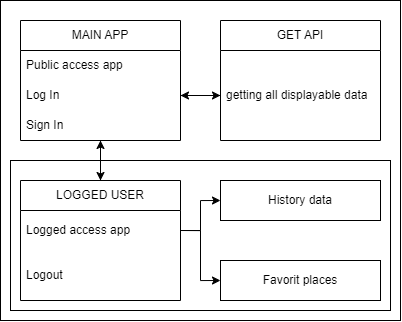

# Weather App

---
### STIN 2024
### Jan Hartig
---

## Popis aplikace
Aplikace má za úkol řešit systém pro předpověď počasí, který by měl zobrazovat aktuální počasí, předpověď na následující dny a historii počasí za poslední dny. Aplikace umožní uživatelům vytvořit si vlastní účet. Bude dostupná jak na počítačích, tak i na mobilních telefonech a nabídne uživatelské rozhraní podobné webovému prohlížeči.

Data o počasí budou získávána z veřejně dostupného API, které poskytuje komplexní informace o počasí v různých formátech.

## Požadavky na spuštění
- Webový prohlížeč - Chromium - verze 120.xxx a výše
- 
## Využité technologie
- Programovací jazyk: Python 3.11.0
- Nadstavba: Flask
- Databáze: MySQL
- Internetové připojení

## Uživatelské rozhraní - GUI
Aplikace je v anglickém jazyce. Systém se bude skládat z několika webových stránek:
1. Home page
   Zde jde uživateli umožněno používat aplikaci bez nutnosti přihlášení, v omezeném režimu > zobrazení pouze aktuálního počasí na určitém místě.
   Po zadání vybraného města se uživateli zobrazí
   - teplota v zadaném městě
   - textový popis počasí
   - grafická předpověď pomocí obrázku
  
2. Log in page
   Zde uživatel zadá email a heslo pro příhlášení, potom lze aplikaci používat jako placený uživatel

3. Sign up page
   Na této stránce se uživatel může přihlašovat do systému jako prémiový uživatel.
   Po uživateli je vyžadováno:
   - emailová adresa ve validním stavu
   - jméno uživatele
   - zadaní dvou shodných hesel
  
4. Po úspěšném přihlášení jsou uživateli dostupné další funkce:
   - zobrazování historie počasí v daném městě, v rozsahu 7 dní zpátky
   - možnost přídání si oblíbeného místa, u kterého je vypsána předpověd počasí na 1 den dopředu v textovém zobrazení
  
5. Přihlášeným uživatelům je přídáno tlačítko na odhlášení z ůčtu

## Struktura aplikace

## Chybové stavy
Uživatel bude při chybě buď z jeho strany, nebo ze strany serveru upozorňován vhodnými prostředky tak, aby mu napomáhali tento problém vyřešit a aby docházelo ke správné činnosti systému.

Příklady chybových stavů pro uživatele:
- Špatně zadaná hodnota - systém zabrání potvrzení požadavku se špatně zadanou hodnotou a upozorní uživatele
Příklady chybových stavů pro administrátora:
- Chybné, žádné připojení databáze - systém nebude pokračovat, dokud databáze nebude správně spuštěna
- Nemožnost připojit systém k internetu - systém nebude pokračovat, dokud nebude moci úspěšně využívat funkčnosti použitého API

  
## Vývoj 
Doba strávená na vývoji 3 člověko-dny
